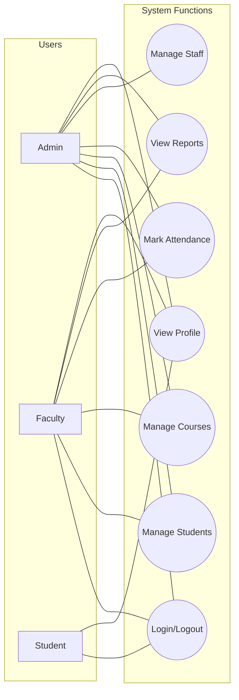
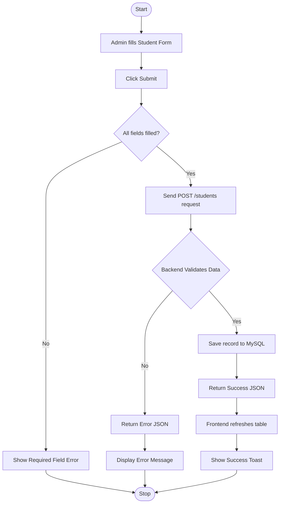
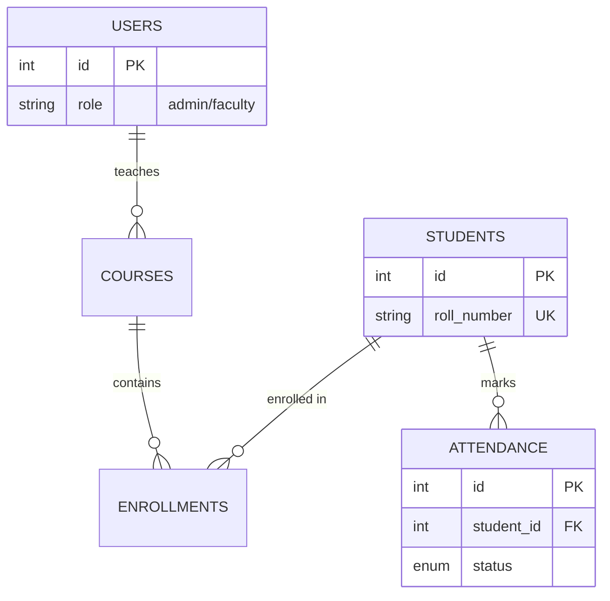

# 🎓 Master Project Guide: Student Management System

Welcome to Student Management System. This document is your "All-in-One" resource to understand how this system works, from the high-level design to the specific lines of code.

---

## 🏗️ Part 1: Architecture & Modules

The project is built using a **Client-Server Architecture**:
- **Frontend (Client)**: Built with HTML, CSS, and JavaScript. This is what you see in the browser.
- **Backend (Server)**: Built with Python (FastAPI). This is the "brain" that processes data.
- **Database**: MySQL. This is where all the students, users, and courses are permanently saved.

### Functional Modules:
| Module | Purpose | Key Components |
| :--- | :--- | :--- |
| **Auth** | Security | Register, Login, JWT Tokens, Role-Based Access Control (RBAC). |
| **Students** | Records | Student demographics, Roll Number tracking, Enrollment details. |
| **Courses** | Academic | Subject definitions, Credits management, Department mapping. |
| **Attendance** | Tracking | Daily presence logs, Status (Present/Absent/Late). |
| **Users** | Admin | Management of Faculty and staff accounts. |

---

## 📂 Part 2: Project Folder Structure

Knowing where files are located is the first step to becoming a great developer.

```text
students-form/
├── backend/                # 🧠 The Server (Python/FastAPI)
│   ├── main.py             # Core API logic and routes
│   ├── models.py           # Database tables and relations
│   ├── requirements.txt    # Python libraries needed
│   └── config.py           # Environment settings
├── frontend/               # 🎨 The Interface (HTML/CSS/JS)
│   ├── index.html          # Structure of the dashboard
│   ├── styles.css          # Beautiful designs & animations
│   ├── script.js           # Interactive frontend logic
│   └── package.json        # Frontend build settings
└── database/               # 🗄️ Data Management
    ├── setup_db.py         # Script to create the database
    └── seed_db.py          # Script to add sample data
```

---

## 🛠️ Part 3: Installation & Startup Guide

Follow these steps to get the project running on your local machine.

### 1. Database Setup
- Install **MySQL Server**.
- Create a database named `student_db`.
- Update the connection string in `backend/models.py`.

### 2. Backend Setup
```bash
cd backend
pip install -r requirements.txt
python main.py
```
*The server will now be running on `http://127.0.0.1:8000`*

### 3. Frontend Setup
```bash
cd frontend
npm install
npm run dev
```
*Open your browser and visit the URL shown in your terminal!*

---

## 🛠️ Part 4: Technical Stack & Advanced Concepts

### The "Teches" Used:
- **FastAPI**: A modern, high-performance web framework for building APIs with Python.
- **Vite**: A lightning-fast frontend build tool.
- **SQLAlchemy**: An "ORM" that lets us talk to the database using Python objects instead of SQL commands.
- **JWT (JSON Web Tokens)**: Securely transmits information between frontend and backend as a JSON object.

### Advanced Features:
1. **Auto-Documentation**: Add `/docs` to your backend URL (e.g., `http://localhost:8000/docs`) to see the **Swagger UI**, which lists every API automatically!
2. **CORS Middleware**: Allows your frontend (on one port) to talk securely to your backend (on another port).
3. **Password Hashing**: Uses `bcrypt` to scramble passwords so even if the database is stolen, no one can see the real passwords.

---

## 🖼️ Part 5: User Interface (UI) Mockups

Visualizing the final product helps in understanding the user experience.


*Figure 1: Minimalist Login Page with Glassmorphism effect.*


*Figure 2: Premium Dashboard with dark mode and analytics visualizations.*

---

## 📋 Part 6: Use Case Diagram

This diagram explains "Who" can do "What" in the system.


*Figure 3: Use Case Diagram showing actor roles and system module access.*



---

## 🔄 Part 7: Activity Diagram

This diagram shows the logic flow for a specific action, like **Adding a Student**.


*Figure 4: Activity Diagram for the "Add Student" process.*



---

## 📊 Part 8: Database Design (ERD)

The database uses "Relationships" to link tables. For example, an **Attendance** record is linked to a **Student** via a `student_id`.


*Figure 5: Entity Relationship Diagram (ERD) showing the high-resolution database schema.*



---

## 🔍 Part 9: Code Logic Deep Dive (Line-by-Line)

Understanding the logic behind the code is crucial for a new developer.

### 3.1 Fetching a Student by ID
```python
# The @app.get decorator maps the URL /students/ID to this function.
@app.get("/students/{student_id}", response_model=StudentResponse)
async def get_student(student_id: int, db: Session = Depends(get_db)):
    try:
        # Search the database for the first record matching the ID.
        db_student = db.query(Student).filter(Student.id == student_id).first()
        
        # If the query returns 'None', we tell the user "Not Found" (404).
        if db_student is None:
            raise HTTPException(status_code=404, detail="Student not found")
            
        # If found, FastAPI sends the data back as a JSON object.
        return db_student
    except Exception as e:
        # Catch-all for unexpected errors (e.g. database connection failed).
        raise HTTPException(status_code=500, detail=str(e))
```

### 3.2 Secure Login (Authentication)
```python
@app.post("/auth/login")
async def login(credentials: UserLogin, db: Session = Depends(get_db)):
    # 1. Find the user by their email.
    user = db.query(User).filter(User.email == credentials.email).first()
    
    # 2. Check if user exists & if the password hash matches.
    if not user or not verify_password(credentials.password, user.hashed_password):
        raise HTTPException(status_code=401, detail="Invalid login")
    
    # 3. Create a JWT Token (Digital ID Card) that expires in 30 mins.
    access_token = create_access_token(data={"sub": str(user.id)})
    return {"access_token": access_token, "user": user}
```

---

## 🚀 Part 10: Interactive User Flows (Slides)

Follow these carousels to see the journey from a Button Click to a Database Save.

### Flow: Student Registration
````carousel
### Slide 1: Frontend (User Action)
```javascript
// A listener catches the form submit.
registerForm.addEventListener('submit', async (e) => {
    e.preventDefault();
    const data = Object.fromEntries(new FormData(registerForm));
    await register(data); // Send to backend
});
```
<!-- slide -->
### Slide 2: Backend (Processing)
```python
@app.post("/auth/register")
async def register(user_data: UserCreate, db: Session = Depends(get_db)):
    # Scramble the password for security.
    pwd_hash = get_password_hash(user_data.password)
    # Create the DB entry.
    db_user = User(**user_data.dict(), hashed_password=pwd_hash)
    db.add(db_user)
    db.commit() # Save to MySQL
    return db_user
```
````

### Flow: Marking Attendance
````carousel
### Slide 1: Frontend (Frontend)
```javascript
async function markAttendance(student_id, status) {
    await fetch('/attendance', {
        method: 'POST',
        headers: getAuthHeaders(), // Pass the security token
        body: JSON.stringify({ student_id, status })
    });
}
```
<!-- slide -->
### Slide 2: Backend (Persistence)
```python
@app.post("/attendance")
async def mark_attendance(att: AttendanceCreate, db: Session = Depends(get_db)):
    # Record the timestamp and status in the Attendance table.
    db_att = Attendance(**att.dict(), date=datetime.utcnow())
    db.add(db_att)
    db.commit()
    return db_att
```
````

---

## 📈 Next Steps for You:
1.  **Modify a field**: Try adding a "Gender" field to the `Student` model and a new input to the frontend form.
2.  **Add a new API**: Try creating a "Search" endpoint that filters students by their Department.
3.  **Style the UI**: Open `styles.css` and try changing the `--primary-color` to see the entire dashboard transform.

**Happy Coding!**
